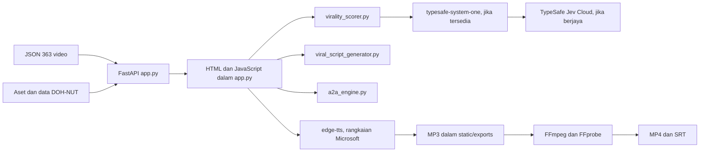

# Seni bina ViralStudio

## Gambaran sistem

`app.py` memuatkan JSON semasa import, menyediakan endpoint REST, dan menjana HTML/JavaScript satu halaman dalam `serve_ui()`. Ia bukan frontend berasingan. Tab utama ialah Hub, DOH-NUT, A2A, Scorer dan Script Studio.

## Modul

| Fail | Tanggungjawab |
| --- | --- |
| `app.py` | Server tempatan, API, UI, TTS, sari kata dan render. |
| `virality_scorer.py` | Pengekstrakan hook, pilihan Jev, peraturan skor, tier dan cadangan. |
| `viral_script_generator.py` | Templat rawak untuk skrip empat fasa. |
| `a2a_engine.py` | Simulasi aliran Zara–Tariq–Sam dan respons copilot berdasarkan kata kunci. |
| `scrape_all_khairulaming_tiktok.py` | Penuaian katalog melalui Playwright dan respons rangkaian TikTok. |
| `analyze_all_363_videos.py` | Klasifikasi kelompok setempat dan eksport JSON/CSV. |
| `static/` | Manifest PWA, service worker, ikon dan fail eksport media. |

## Sempadan perkhidmatan dan data

- Server Uvicorn di `127.0.0.1:8765` secara lalai (`PORT` boleh mengubah port).
- `app.py` merujuk laluan mutlak Windows untuk projek ini dan `Doh-Nut\public`; pemasangan pada mesin lain belum automatik.
- UI mengambil pustaka dan fon daripada CDN. TTS baharu menggunakan `edge-tts` melalui rangkaian; fail audio yang sudah dicache boleh digunakan semula.
- Integrasi TypeSafe adalah pilihan dalam scorer, tetapi semasa disemak, `/api/score` jatuh ke heuristik akibat akses `resp.results` yang tidak sepadan dengan respons klien semasa.
- `analyze_all_363_videos.py` memaksa `mode="local"`; masa 1–15 ms dalam laporan kelompok merujuk enjin setempat, bukan latensi API Jev Cloud.

## Aliran render semasa

`POST /api/render-video` → `synthesize_speech()` → MP3 cache → `asyncio.to_thread(render_vertical_video)` → SRT enam perkataan setiap ketulan → FFmpeg crop/scale 720×1280, bakar sari kata dan tambah audio AAC → MP4 dalam `static/exports`. Render FFmpeg keluar daripada event loop, tetapi TTS dan FFprobe masih perlu dinilai berasingan untuk beban serentak. Nama output menggabungkan audio stem, video stem dan hash skrip.

Service worker didaftarkan dari `/static/sw.js`; tanpa skop yang diluaskan, ia hanya mengawal URL di bawah `/static/`. Maka kehadiran manifest dan pendaftaran service worker sahaja belum membuktikan halaman utama boleh digunakan offline.
