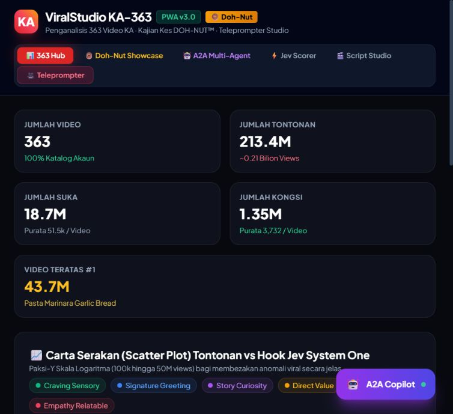
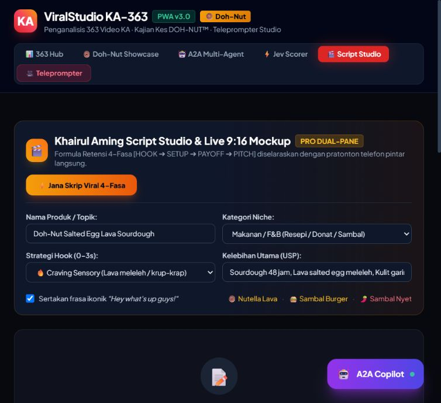

# ViralStudio: Pelan Penambahbaikan Produk dan GitHub

Tarikh semakan: 24 September 2026. Status: cadangan untuk pelaksanaan, bukan ciri yang sudah siap.

Semakan susulan: roadmap asal tertinggal reka bentuk penjanaan imej. Bahagian 11 kini menetapkan penyedia cadangan, aliran aset, kontrak API, kos, kegagalan dan ujian penerimaan. Dokumen ini ialah pelan produk; akses akaun, model yang tersedia dan kadar kos masih perlu disahkan ketika implementasi.

## 1. Arah produk

Bina studio video pendek sumber terbuka yang membantu pengguna menghasilkan video daripada brief, dengan skrip, suara, sari kata dan eksport dalam satu aliran. Sokong Bahasa Melayu dan Inggeris; jadikan DOH-NUT contoh brand pack yang boleh diganti pengguna.

Janji produk yang dicadangkan: **“Dari idea ke video pendek bersari kata, dalam satu studio.”** Elakkan menjanjikan jumlah tontonan atau mengimplikasikan hubungan rasmi dengan pencipta yang datanya dikaji.

Kumpulan pengguna pertama: pemilik bisnes kecil dan pencipta kandungan yang mahu menyiapkan video produk tanpa berpindah antara banyak alat. Fokus pada satu hasil: pengguna baharu berjaya mengeksport video pertama.

## 2. Penggunaan Jev sebenar dalam semakan ini

TypeSafeClient dalam mod cloud digunakan untuk menilai pilihan berstruktur berdasarkan ringkasan keadaan projek dan pilihan pelan yang diberikan. Respons melaporkan engine cloud, latency 1864.6 ms:

| Keputusan | Pilihan Jev | Confidence respons |
|---|---|---:|
| Arah produk | Studio video umum; DOH-NUT sebagai demo pilihan | 0.94 |
| Kerja pertama | Aliran penciptaan hujung ke hujung yang boleh dipercayai | 1.0 |
| Peranan Jev | Semakan kualiti berstruktur dan routing | 1.0 |
| Halaman utama | Cipta atau sambung projek | 1.0 |

Ini penilaian terhadap pilihan yang dibekalkan, bukan kajian pasaran bebas. Confidence tersebut bukan kebarangkalian projek berjaya atau viral. Jev tidak menjana keseluruhan dokumen ini; hasilnya digunakan untuk menyusun cadangan.

## 3. Bukti dashboard semasa

Semakan visual meliputi halaman utama dan kemasukan Script Studio pada viewport panel pelayar sekitar 754 × 689. Ini bukan ujian telefon, keyboard atau audit pematuhan aksesibiliti penuh.

### Langkah 1 — Halaman utama: perlu diperbaiki

Statistik sejarah memenuhi ruang awal; tindakan mencipta atau menyambung projek tiada pada paparan pertama. Navigasi membalut ke baris kedua. Copilot terapung menutup sebahagian carta. Metrik yang besar juga memerlukan konteks kualiti data sebelum pengguna menganggapnya bukti prestasi produk.

### Langkah 2 — Script Studio: asas berguna, masih membebankan pengguna baharu

Butang penjanaan jelas, tetapi borang meminta Niche, Hook dan USP sebelum pengguna menerangkan hasil yang diinginkan. USP satu baris memotong teks yang kelihatan. Pratonton tidak kelihatan pada viewport pertama; copilot bertindih dengan panel bawah. Frasa khusus pencipta dipilih secara lalai, sedangkan pengguna patut membina suara jenama sendiri.

## 4. Dashboard yang dicadangkan

Navigasi utama: **Utama · Projek · Aset · Analitik · Tetapan**. Jadikan “Cipta Video” tindakan utama yang konsisten. Letakkan alat teknikal dan diagnostik dalam pilihan lanjutan.

Susunan halaman utama:

1. Tajuk ringkas: “Video apa yang nak dibuat hari ini?” dan butang Cipta Video.
2. Sambung projek terakhir: thumbnail, nama, status, tarikh kemas kini dan satu tindakan Sambung.
3. Projek terkini: Draf, Sedia Disemak, Sedang Dirender, Selesai; status mesti ditulis, bukan warna sahaja.
4. Barisan render: kemajuan sebenar, masa berlalu, batal/cuba semula. Jangan papar peratus rekaan.
5. Ringkasan penggunaan: video siap, masa render dan penggunaan penyedia yang benar-benar direkodkan.

Aliran studio: **Brief → Pilih Skrip → Edit & Pratonton → Eksport**.

- Brief ringkas: produk/topik, sasaran penonton, tujuan, bahasa dan durasi sasaran. Pilihan hook, tempo dan suara masuk dalam bahagian lanjutan.
- Tawarkan tiga variasi skrip yang berbeza; jelaskan sebab cadangan dalam satu ayat. Pengguna boleh terus mengedit.
- Desktop lebar: editor kiri, pratonton kanan. Skrin sempit: tab Edit/Pratonton yang mudah ditukar.
- Paparkan amaran yang boleh ditindak: “Audio melebihi durasi sasaran”, dengan pilihan pendekkan skrip atau tambah durasi.
- Eksport hanya aktif apabila input wajib tersedia; nyatakan apa yang belum siap.
- Autosave dengan status disimpan; paparkan sebab dan langkah pemulihan jika gagal.

Gaya visual: satu warna aksen utama, tipografi jelas, ruang konsisten, ikon bersama label, empty/loading/error/success states. Sediakan fokus keyboard, label borang, pengurangan animasi dan semakan kontras. Animasi 3D boleh kekal sebagai pilihan showcase dengan lazy loading. Copilot dibuka apabila diminta supaya tidak menutup kerja utama.

## 5. Ciri advanced yang memberi manfaat nyata

| Keutamaan | Ciri | Nilai kepada pengguna | Syarat penerimaan |
|---|---|---|---|
| P0 | Projek tersimpan dan boleh disambung | Kerja tidak hilang | Muat semula dan restart mengekalkan skrip, aset serta pilihan eksport |
| P0 | Semakan Jev yang boleh dijejaki | Faham isu skrip dan sebab cadangan | Papar penyedia sebenar, fallback dan versi rubric; skor tidak dilabel ramalan views |
| P1 | Brand kit | Hasil konsisten untuk pelbagai bisnes | Logo, warna, font, gaya bahasa dan CTA digunakan pada preview serta eksport |
| P1 | Sari kata bertimestamp | Kurangkan pembetulan manual | Guna timestamp penyedia/ASR jika tersedia; editor membolehkan pembetulan masa dan teks |
| P1 | Safe-area dan format eksport | Teks tidak terpotong oleh UI platform | Preview dan eksport sepadan untuk 9:16; tambah 1:1 dan 16:9 selepas itu |
| P1 | Import/eksport projek | Kolaborasi dan reproduksi | Bundle menyenaraikan aset, versi dan konfigurasi; aset hilang dilaporkan dengan jelas |
| P2 | Eksperimen variasi | Belajar daripada hasil penerbitan sebenar | Rekod variasi dan metrik mengikut tempoh; jangan menyimpulkan sebab-akibat daripada korelasi sahaja |
| P2 | Adapter penyedia | Pilihan kos, bahasa dan privasi | Kontrak sama untuk TTS/model, dengan had, timeout dan mesej kegagalan yang jelas |

## 6. Kecekapan token, masa dan mesin

Pipeline cadangan: validasi biasa → Jev untuk semakan berstruktur → model generatif jika perlu menulis/menyemak semula → semakan hasil → render.

- Semak input kosong, panjang, format dan aset tanpa model. Gunakan Jev untuk keputusan yang mempunyai label/skema jelas; jangan hantar seluruh repositori setiap kali.
- Gabungkan soalan berkaitan jika kontrak API menyokongnya. Hantar hanya konteks yang diperlukan dan rekod latency serta penggunaan sebenar.
- Tetapkan had percubaan pembaikan, timeout dan bajet bagi setiap projek. Elakkan perdebatan ejen tanpa kriteria berhenti.
- Cache berdasarkan input dinormalisasi, penyedia/model, versi prompt/rubric, suara, kelajuan, kandungan aset dan tetapan render. Gunakan hash penuh yang sesuai; jangan mendakwa keunikan mutlak.
- Bezakan hasil sedang diproses daripada hasil lengkap; deduplicate permintaan sama dan tulis fail secara atomik supaya cache tidak memulangkan output separuh siap.
- Gunakan job queue untuk render, dengan status tersimpan, cancel, retry terhad dan pembersihan fail sementara. Mula dengan concurrency rendah, kemudian tentukan had melalui pengukuran CPU/RAM.
- SQLite sesuai sebagai cadangan awal untuk projek dan job pada penggunaan setempat. Jangan tambah distributed microservices sebelum keperluannya wujud.
- Pisahkan route, domain, adapter penyedia, worker dan frontend secara berperingkat. Pecahkan app.py tanpa menukar semua framework serentak.
- Bundel aset frontend yang diperlukan, lazy-load 3D/carta, dan sediakan konfigurasi path relatif. Dokumentasikan komponen yang masih memerlukan internet.

`asyncio.to_thread` membantu melepaskan event loop, tetapi tidak menyediakan queue, had CPU, pemulihan job atau bukti kapasiti ribuan pengguna.

## 7. Baiki asas sebelum mempromosi

Dapatan terdahulu yang perlu disemak semula semasa pelaksanaan:

- Kontrak scorer menggunakan medan respons yang tidak sepadan dengan wrapper, menyebabkan fallback. Betulkan adapter dan uji kegagalan cloud secara jelas.
- Penapis hook membaca skema bersarang sedangkan dataset menggunakan medan rata. Selaraskan satu skema.
- Daripada 363 rekod, hanya 67 mempunyai views positif; 296 mempunyai nilai sifar/tiada metrik. Jangan samakan nilai tidak diketahui dengan prestasi sifar.
- Semua label hook sama; tiada transkrip. Audit kaedah label dan provenance sebelum mendakwa formula retensi berasaskan kandungan video.
- Sahkan author ID setiap rekod. Kandungan jadual menimbulkan kemungkinan pencampuran video; pemilikan belum disahkan untuk semua rekod.
- Buang skor minimum rekaan dalam aliran A2A dan asingkan template demonstrasi daripada agen/model sebenar.
- Sari kata semasa menggunakan pembahagian masa anggaran, bukan penyelarasan perkataan sebenar. Nyatakan batasannya sehingga diganti.
- Tambah validasi path/input, had permintaan render, timeout, polisi storan dan pembersihan. Sahkan scope service worker sebelum mendakwa root app berfungsi offline.

## 8. Pelan pelaksanaan untuk ejen seterusnya

### Fasa A — Kebolehpercayaan

Baiki kontrak Jev dan data, keluarkan dakwaan metrik tidak disokong, tambah konfigurasi persekitaran dan senarai dependency terkunci. Syarat siap: pemasangan bersih boleh menghasilkan satu video contoh, kegagalan penyedia dilaporkan dengan jujur, dua aset berbeza tidak berkongsi hasil cache yang salah.

### Fasa B — Aliran pengguna

Bina Home berasaskan projek, aliran empat langkah, autosave dan editor responsif. Syarat siap: pengguna baharu boleh menyiapkan eksport tanpa membaca dokumentasi dalaman; projek boleh disambung selepas restart. Uji keyboard, viewport sempit dan keadaan ralat.

### Fasa C — Kecekapan produksi

Bina queue, deduplication, cache berversi, progress/cancel/retry, cleanup dan timestamp sari kata. Syarat siap: API kekal responsif semasa render, job serentak tidak merosakkan output, pembatalan menghentikan proses anak, dan kadar penggunaan direkodkan.

### Fasa D — Keluaran GitHub

Sediakan demo boleh ulang, release bertag, CI dan panduan contributor. Syarat siap: orang luar boleh clone dan mengikuti quickstart pada OS yang didakwa disokong; semua dakwaan README mempunyai bukti atau ditandakan roadmap.

Elakkan menjadualkan tarikh siap sebelum ejen mengukur skop sebenar. Setiap fasa perlu bukti penerimaan, bukan hanya screenshot atau HTTP 200.

## 9. Peluang mendapat perhatian GitHub

Tiada cara menjamin projek paling viral. Tingkatkan peluang melalui produk yang menyelesaikan masalah, demo yang mudah difahami dan pemasangan yang berjaya.

- README pembuka: satu ayat nilai produk, video/GIF pendek, hasil MP4 sebenar, quickstart, batasan dan jadual ciri siap/dirancang.
- Demo tanpa kunci API dengan aset contoh yang boleh diedarkan dan output prajana yang dilabel. Jangan menyamarkannya sebagai inferens langsung atau kemampuan offline penuh.
- Sediakan pemeriksaan prasyarat FFmpeg, dependency terkunci, contoh konfigurasi tanpa rahsia dan mesej pemasangan yang membantu.
- Tambah LICENSE selepas pemilik menentukan hak kod/aset, SECURITY.md, CODE_OF_CONDUCT.md, issue templates dan PR template; semak CONTRIBUTING sedia ada.
- Gunakan CI untuk kontrak API, data schema, cache, kegagalan job dan render contoh kecil. Nyatakan platform yang benar-benar diuji.
- Sediakan isu kecil dengan langkah reproduksi dan hasil jangkaan. Terbitkan changelog dan demo untuk release yang berfungsi.
- Kongsi dengan komuniti pencipta, video open source dan pembangun yang relevan; minta maklum balas khusus. Elakkan spam, stars berbayar dan claim prestasi yang belum diuji.

Metrik kejayaan: kadar pemasangan berjaya, kadar eksport pertama, masa ke eksport pertama, kadar kegagalan, pengguna kembali dan contributor aktif. Rekod secara setempat atau gunakan telemetry opt-in yang jelas. Stars ialah petunjuk perhatian, bukan bukti nilai produk.

Rujukan: [Open Source Guides — Finding Users](https://opensource.guide/finding-users/) menyarankan nilai produk yang jelas dan perkongsian kepada komuniti relevan. [GitHub — Community Profiles](https://docs.github.com/en/communities/setting-up-your-project-for-healthy-contributions/about-community-profiles-for-public-repositories) menerangkan fail sokongan komuniti. [GitHub — About READMEs](https://docs.github.com/en/repositories/managing-your-repositorys-settings-and-features/customizing-your-repository/about-readmes) menerangkan peranan README sebagai pintu masuk repositori.

## 10. Arahan handoff

Mulakan Fasa A, sahkan semula kod terkini dan baca arahan repositori sebelum mengedit. Kekalkan dokumentasi fakta berasingan daripada roadmap. Setiap hasil kerja hendaklah menyatakan perubahan, bukti ujian, batasan dan kerja tertunggak. Jangan menerbitkan repo/aset, menghantar promosi atau membuat dakwaan virality tanpa arahan dan bukti yang sesuai.

## 11. Penjanaan imej dan aliran aset — spesifikasi pelaksanaan

Semakan susulan Jev Cloud terhadap ringkasan cadangan ini memilih `ready_as_roadmap_extension` dan `structured_routing_only`. Ini penilaian liputan cadangan berstruktur, bukan audit keseluruhan dokumen atau pengesahan integrasi yang sudah berjalan.

### 11.1 Keputusan teknologi

**Keputusan pengguna terkini: gunakan ekosistem Google melalui profil Chrome `thisisdohnut@gmail.com`.** Flow, Stitch, NotebookLM, Gemini, Opal dan AI Studio menggantikan cadangan OpenAI Images API. Bahagian 12 menentukan laluan pelaksanaan. `ImageProvider` dan kontrak job di bawah ialah reka bentuk dalaman cadangan; penggunaan laman web tidak bermaksud API aplikasi sudah disambungkan.

Alat ImageGen yang tersedia dalam sesi pembantu ini tidak secara automatik tersedia kepada aplikasi FastAPI. Integrasi aplikasi memerlukan adapter, kelayakan API dan pengendalian hasilnya sendiri. Tiada langganan atau panggilan imej berbayar dibuat melalui perubahan dokumen ini.

| Komponen | Peranan | Status dalam pelan |
|---|---|---|
| Upload foto/video produk | Bahan sebenar dan rujukan visual utama | Laluan asas yang mesti berfungsi tanpa penyedia imej |
| Google Flow / Gemini / alat media Opal | Jana imej dan video mengikut fungsi yang tersedia pada akaun | Laluan pelayar diminta pengguna; akses belum disahkan |
| Google AI Studio / Gemini API | Eksperimen model dan pilihan adapter API rasmi | Integrasi API hanya selepas akses serta billing disahkan; berasingan daripada sesi Chrome |
| Jev | Pilih laluan upload/generate/edit dan semak medan brief berstruktur | Bukan penjana piksel; jangan dakwa semakan visual tanpa sokongan input imej yang disahkan |
| Model teks | Bina prompt visual daripada skrip dan brand kit jika diperlukan | Adapter berasingan; template deterministik boleh digunakan dahulu |
| FFmpeg | Gabung imej/video, gerakan pan/zoom, suara dan sari kata | Komposisi video; animasi foto tidak sama dengan model generatif video |

Penjanaan video AI sebenar melalui Google Flow kini termasuk dalam skop pengguna. Jangan melabel slideshow beranimasi sebagai rakaman produk sebenar. Pilihan model, tempoh, format dan kredit mesti direkod daripada UI akaun semasa.

### 11.2 Aliran pengguna lengkap

**Brief → Skrip → Visual setiap babak → Suara & sari kata → Pratonton → Eksport.** Empat langkah utama UI boleh dikekalkan dengan Visual sebagai bahagian Edit & Pratonton.

1. Pengguna upload produk atau pilih aset sedia ada. Foto asal disimpan berasingan daripada hasil edit.
2. Setiap babak mempunyai teks, durasi sasaran dan pilihan **Guna Aset / Jana Visual / Edit Visual**.
3. Panel Jana Visual menyediakan prompt boleh edit, rujukan produk, gaya brand kit, orientasi dan bilangan variasi. Default satu imej untuk mengawal kos.
4. Paparkan sama ada rujukan akan dihantar ke penyedia awan, anggaran kos jika tersedia, dan baki bajet projek. Jana hanya selepas tindakan pengguna.
5. Job berjalan di latar; pengguna boleh terus mengedit. Hasil masuk galeri dengan label Upload atau AI Generated, bukan terus menggantikan aset terpilih.
6. Pengguna pilih hasil dan tetapkan crop/focal point. Logo, harga dan CTA sebaiknya ditambah sebagai lapisan teks/grafik terkawal supaya mudah dibetulkan.
7. Pratonton menggunakan manifest babak yang sama dengan renderer: asset ID, tempoh, crop, transisi, audio dan sari kata. Eksport menyimpan snapshot versi manifest.

Rupa produk dalam imej AI boleh berubah walaupun ada rujukan. Sediakan perbandingan asal/hasil dan kekalkan pilihan guna foto asal tanpa penjanaan semula.

### 11.3 Kontrak backend dan penyimpanan

Semua endpoint di bawah ialah **cadangan baharu**, bukan API semasa:

| Endpoint | Input/hasil minimum |
|---|---|
| `POST /api/assets` | Upload tervalidasi → asset ID, jenis, dimensi dan thumbnail |
| `POST /api/image-jobs` | project ID, scene ID, generate/edit, prompt, reference asset IDs, preset, idempotency key → HTTP 202 dan job ID |
| `GET /api/jobs/{id}` | queued/running/succeeded/failed/cancel_requested/cancelled, mesej, asset IDs dan penggunaan tersedia |
| `POST /api/jobs/{id}/cancel` | Minta batal; laporkan jika permintaan penyedia sudah tidak boleh dihentikan |
| `PATCH /api/projects/{id}/scenes/{scene_id}` | Pilihan aset, crop dan durasi dengan semakan versi untuk mengelakkan edit tertindih |

Adapter menerima permintaan dalaman yang stabil dan menukar preset kepada pilihan yang benar-benar disokong model. Tolak kombinasi tidak disokong sebelum panggilan berbayar. Simpan model/provider, hash input dan rujukan, versi prompt, dimensi, masa, usage jika tersedia, anggaran kos berserta tarikh kadar, dan status semakan pengguna. Jangan simpan kunci API dalam manifest, log atau bundle projek.

Validasi MIME sebenar, saiz fail, dimensi dan pemilikan asset ID. Gunakan ID dalaman untuk rujukan fail; jangan menerima path filesystem sewenang-wenangnya. Tulis hasil secara atomik sebelum menandakan job berjaya. Preview kecil boleh dijana daripada hasil asal; eksport menggunakan aset penuh.

### 11.4 Bajet dan kegagalan

- `IMAGE_PROVIDER`, `IMAGE_MODEL`, `IMAGE_MAX_CONCURRENCY` dan had per projek ialah konfigurasi aplikasi yang dicadangkan. Kunci penyedia berada di backend sahaja.
- Had keras bilangan job dan imej mengawal penggunaan walaupun harga tepat tidak tersedia. Jangan papar RM0 apabila kos tidak diketahui.
- Buat reservasi bajet sebelum dispatch job serentak. Bezakan kos anggaran daripada usage yang penyedia benar-benar melaporkan; jangan menjanjikan bil akhir tepat sebelum rekonsiliasi.
- Cache mengikut prompt, rujukan, model, preset dan versi; Jana Semula mesti menghasilkan permintaan baharu yang jelas. Klik berganda dengan idempotency key sama tidak boleh mencetus dua caj.
- Jika timeout selepas dispatch, tandakan hasil tidak pasti dan jangan retry berbayar secara membuta tuli. Cuba semula hanya mengikut jaminan penyedia/idempotency yang disahkan.
- Untuk tiada kunci, quota habis, penolakan penyedia atau rangkaian gagal: kekalkan draf dan tawarkan upload/guna aset sedia ada. Jangan gantikan kegagalan dengan gambar demo tanpa label.
- Batal tidak semestinya memulangkan caj jika penyedia sudah memproses. Paparkan keadaan sebenar; jangan menjanjikan pembatalan awan yang adapter tidak menyokong.

### 11.5 Kerja dan ujian penerimaan

Masukkan kontrak aset dan konfigurasi dalam Fasa A; galeri, pemilih babak dan adapter imej dalam Fasa B; queue, cache dan bajet dalam Fasa C. Fasa D hanya mendakwa AI image generation setelah integrasi langsung diuji.

- Tanpa API key: upload → pilih babak → preview → eksport berjaya.
- Dengan penyedia ujian: jana/edit → pilih hasil → simpan → restart → eksport mengekalkan aset yang dipilih.
- Provider mock menguji 429, timeout, penolakan dan hasil rosak; UI mengekalkan draf dan menerangkan tindakan pemulihan.
- Ujian dua klik dan dua job serentak membuktikan deduplication dan had bajet; semak tiada kunci dalam respons/log.
- Sekurang-kurangnya satu ujian integrasi sebenar diperlukan apabila akaun dan bajet tersedia; ujian mock sahaja tidak membuktikan akses penyedia.
- Bandingkan bingkai eksport dengan preview untuk crop, orientasi, logo, teks dan durasi. Pengguna boleh menukar satu babak tanpa menjana semula seluruh projek.

### 11.6 Dokumentasi yang perlu dikemas kini bersama implementasi

| Fail | Kandungan wajib apabila ciri dibina |
|---|---|
| `README.md` | Upload vs penjanaan awan, persediaan, kos dan batasan |
| `docs/ARCHITECTURE.md` | Adapter imej, asset store, queue dan manifest babak |
| `docs/API_REFERENCE.md` | Endpoint sebenar, skema, ralat dan idempotency |
| `docs/JEV_SYSTEM_ONE.md` | Routing berstruktur dan sempadan keupayaan Jev |
| `docs/UGC_VIDEO_PIPELINE.md` | Imej terpilih → babak → komposisi video |
| `docs/DEVELOPMENT_AND_TESTING.md` | Ujian upload, penyedia mock/live, bajet dan preview/export |

Dokumen keadaan semasa tidak boleh mendakwa endpoint cadangan sudah wujud. Ejen pelaksana hendaklah mengemas kini dokumen berkenaan bersama kod, bukan menyalin roadmap sebagai bukti ciri siap.

## 12. Ekosistem Google dan profil Chrome — arahan pengguna terkini

**Kemas kini akses:** Chrome dohnut kini tersambung. Flow memaparkan akaun sasaran, PRO dan 1,020 kredit semasa semakan. Opal telah membuka galeri selepas login dengan 22 entri yang kelihatan. Lihat [inventori dan batasan pengesahan](GOOGLE_APPS_INVENTORY.md). Status tiada Chrome dalam catatan awal di bawah ialah sejarah sebelum sambungan berjaya, bukan status terkini.

Bahagian ini mengatasi cadangan penyedia terdahulu. Sasaran akaun operasi: `thisisdohnut@gmail.com`. Alamat ini ialah konfigurasi peribadi pengguna; gunakan placeholder dalam bahan GitHub awam. Status semakan sesi: alat pelayar hanya menyenaraikan Edge dan pelayar dalaman, tiada Chrome tersambung. Identiti akaun, entitlement, kredit dan galeri Opal belum disahkan. Tiada imej/video atau aplikasi Google baharu dihasilkan dalam kemas kini dokumen ini.

Jev Cloud menilai ringkasan pelan Google dan memilih `aligned`; langkah seterusnya `connect_requested_chrome_and_inventory`. Ini penilaian pilihan berstruktur, bukan bukti akses akaun atau ujian aplikasi.

### 12.1 Peranan setiap aplikasi

| Aplikasi | Tugasan projek yang dicadangkan | Hasil yang perlu disimpan |
|---|---|---|
| [Flow](https://labs.google/fx/tools/flow) | Jana/edit visual produk, imej rujukan dan klip video | Fail media, pautan projek, prompt, model yang tertera, format, durasi, kredit jika tersedia |
| [Stitch](https://stitch.withgoogle.com/) | Reka Home, Studio, Aset dan queue render yang responsif | Reka bentuk/prototype dan eksport yang benar-benar tersedia; rekod tokens dan keadaan UI |
| [NotebookLM](https://notebooklm.google.com/) | Susun fakta jenama, sumber produk dan hasil kajian | Brief bersumber dengan rujukan; jangan jadikan ringkasan bukti bahawa dataset sudah sah |
| [Gemini](https://gemini.google.com/app) | Idea kempen, skrip, shot list, prompt; media jika fungsi akaun tersedia | Versi skrip/prompt, senarai babak dan aset terpilih |
| [Opal](https://opal.google/landing/) | Inventori seluruh galeri yang boleh diakses, uji dan remix workflow untuk kempen | Daftar aplikasi, input/output, status ujian, pautan remix dan hasil |
| [AI Studio](https://aistudio.google.com/) | Uji prompt/model Google; nilai sambungan API rasmi untuk produk | Konfigurasi eksperimen, hasil ujian dan adapter jika dibina |
| Jev | Routing berstruktur, pilih workflow relevan dan semak kelengkapan brief | Keputusan berlabel, engine sebenar dan alasan rubric |

Peranan dalam jadual ialah rancangan penggunaan. Fungsi UI dan eksport setiap akaun mesti diuji sebelum ditanda tersedia. Flow menyokong penciptaan imej/video; dokumentasi Gemini API menyenaraikan API media termasuk Imagen dan Veo. [Flow rasmi](https://labs.google/fx/tools/flow), [Gemini API rasmi](https://ai.google.dev/api).

### 12.2 Maksud “seluruh apps dalam Opal”

Inventorikan semua entri yang dapat diakses dalam galeri akaun pada tarikh pemeriksaan, termasuk pagination/kategori yang kelihatan. Jangan mereka senarai atau jumlah daripada halaman landing. Buka setiap entri dan rekod nama tepat, URL, tujuan, input, model/tools yang kelihatan, output, akses, kos/quota yang dipaparkan dan kegunaan dalam projek. Tandakan setiap entri `belum diuji`, `lulus`, `gagal`, atau `terhalang`, berserta bukti.

Gunakan/remix aplikasi mengikut fungsi dalam workflow projek dan rekod jika sesuatu aplikasi tidak relevan; jangan memaksa semua aplikasi masuk satu render atau membuat panggilan berulang tanpa tujuan. “Seluruh” hanya boleh ditanda selesai selepas inventori penuh galeri yang boleh diakses disemak; akses terhad mesti dinyatakan.

Galeri rasmi mengandungi demo yang boleh diremix; Opal menyokong langkah input, generate dan output. Ini tidak membuktikan setiap aplikasi Google boleh dipanggil terus daripada Opal. [Dokumentasi Opal](https://developers.google.com/opal/overview). Semak alat sebenar yang tersedia dalam editor, termasuk [Agent Mode](https://developers.google.com/opal/Agent_Mode), sebelum mendakwa sambungan automatik.

### 12.3 Aliran kempen dan dashboard

1. Sahkan profil Chrome dan identiti akaun pada setiap aplikasi melalui UI; akaun laman boleh berbeza daripada profil browser. Jangan menyalin cookies/token atau menganggap akaun Edge sama.
2. NotebookLM: bina brief fakta daripada sumber jenama yang relevan. Asingkan dakwaan belum disahkan.
3. Gemini: hasilkan skrip BM, shot list dan prompt konsisten dengan produk. Jev menyemak kelengkapan dan memilih aliran yang sesuai berdasarkan teks/metadata yang disokong.
4. Opal: pilih/remix aplikasi daripada inventori untuk mengulang langkah brief → prompt → output; uji satu kempen contoh sebelum batch.
5. Flow: hasilkan imej rujukan dan klip daripada babak terpilih. Simpan versi dan semak produk/teks sebelum hasil digunakan.
6. Stitch: bina reka bentuk dashboard berasingan menggunakan keperluan Home/Studio/Aset/Queue; semak preview responsif sebelum port ke aplikasi.
7. Import hasil media ke ViralStudio, gabung dengan suara/sari kata melalui renderer dan semak MP4 akhir.
8. AI Studio: gunakan eksperimen yang berjaya untuk menilai adapter API rasmi apabila automasi backend diperlukan.

Contoh kempen pertama boleh menggunakan produk DOH-NUT daripada katalog sebenar, satu imej hero dan satu klip menegak; jangan reka harga/perisa. Durasi/resolusi dipilih berdasarkan pilihan akaun yang benar-benar tersedia.

### 12.4 Bezakan operasi pelayar dan integrasi produk

Laluan awal ialah operator dalam Chrome berdaftar: buka aplikasi, isi prompt, semak hasil dan eksport/import apabila disokong. ViralStudio menyimpan manifest aset serta provenance. Ia belum menjadi integrasi backend satu klik.

Laluan API ialah kerja kejuruteraan berasingan: dokumentasi rasmi, credentials backend, capability discovery, queue, usage dan ujian kontrak. Login Chrome atau langganan aplikasi tidak membuktikan API billing/akses tersedia. Jangan mereka public API bagi Stitch, Opal atau NotebookLM; sahkan dokumentasi dan akaun terlebih dahulu.

UI perlu membezakan `Sedia melalui pelayar`, `API disambungkan`, `Perlu log masuk`, `Quota habis` dan `Belum disahkan`. Jangan papar progress automatik palsu ketika menunggu hasil aplikasi luar. Jika eksport/import manual diperlukan, nyatakan langkahnya dan jangan claim Zero User Burden sehingga laluan itu diuji.

### 12.5 Syarat siap

- Chrome yang diminta tersambung; identiti akaun setiap aplikasi disahkan tanpa merekod rahsia.
- Semua entri galeri Opal yang boleh diakses disenaraikan dengan hasil pemeriksaan; entri terhalang tidak ditanda lulus.
- Satu workflow contoh mempunyai brief bersumber, skrip, imej dan video sebenar, serta pautan/metadata asal.
- Reka bentuk Stitch meliputi desktop dan skrin sempit; pelaksanaan dashboard dinilai berasingan daripada mockup.
- Media berjaya diimport, preview dan MP4 sepadan; job gagal atau quota habis mengekalkan projek.
- Hasil boleh dikesan kepada aplikasi/model yang digunakan. Pembelian plan/top-up, penerbitan dan perkongsian awam memerlukan arahan khusus; penggunaan biasa dalam skop penjanaan pengguna diteruskan apabila akses tersedia.
